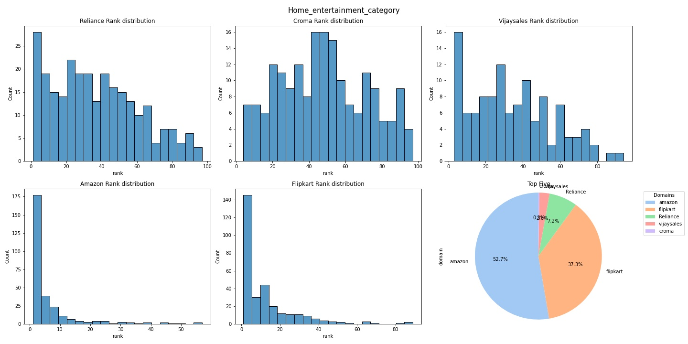

# Serp_EDA_tool
Python scripts to download serp data, and visualize a domain rank against its competitor.

# Requirements
- Serapi API
  ( if not you can try downloading using other cheaper options or if time is not a concern maybe scrape using something like beautiful soup / selenium / etc)
- Python 3
